# OTP Service
- [Introduction](#introduction)
- [What is an OTP Service?](#what-is-an-otp-service)
- [Requirements](#requirements)
	- [Functional Requirements](#functional-requirements)
	- [Non-Functional Requirements](#non-functional-requirements)
- [Capacity Estimation](#capacity-estimation)
	- [Active Users](#active-users)
	- [Throughput](#throughput)
	- [Memory](#memory)
	- [Network and Bandwidth](#network-and-bandwidth)
- [API Design](#api-design)
	- [Generate OTP](#generate-otp)
	- [Verify OTP](#verify-otp)
- [Dive Deep Insights](#dive-deep-insights)
	- [Cache Selection](#cache-selection)
	- [OTP Storage Security](#otp-storage-security)
	- [OTP In-transit Security](#otp-in-transit-security)
	- [High Availability](#high-availability)


## Introduction

When you use your email and password to log into your bank account, it theoretically seems secure because you believe no one else knows your password. However, a password is a non-physical entity, meaning if someone discovers your password, they can use it to access your account from anywhere in the world. Now imagine if your password were a "physical key" instead. If someone has to open your account, they need to have the key with them to open it. This is where MFA comes into play.

Multi-Factor Authentication (MFA) requires you to prove your identity using two or more methods - like **something you know** (password), **something you have** (phone), or **something you are** (fingerprint). It's like needing both your house key and a security code to enter - even if someone steals your password (key), they still can't get in without the second factor (code). 

MFA can be performed using several methods such as sending an OTP (One Time Password) via SMS or email, using your fingerprint, or using a [hardware security key](https://nordpass.com/blog/what-is-hardware-security-key/). 

> Note: For simplicity, we will go into detail about a single MFA service called **OTP Service that performs MFA via SMS OTP**.

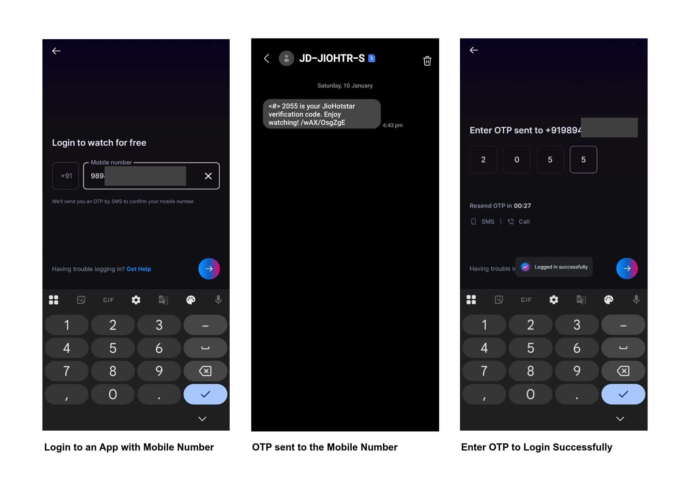

## What is an OTP Service?

An OTP service is the backend system that handles phone verification from start to finish. Here's how it works: you try to log into a website, and the service creates a random OTP, saves it, and texts it to your phone. You type that OTP back into the website, and the service checks if it matches. After you successfully verify, that OTP becomes useless - you can't use it again. It's basically a one-time digital key that self-destructs after use.

## Requirements

### Functional Requirements

| Requirement | Description |
| --- | --- |
| Generate OTP | Generate a random 6-digit single-use OTP and send it to the user via SMS. Invalidate the previous OTP when a new OTP is generated for a session |
| Validate OTP | Accept the OTP entered by the user and verify if it is valid |
| Rate Limit OTP Generation | Throttle requests when the user request 3 OTPs for a session within a 10 minute window |
| Rate Limit OTP Validation | Throttle requests when the user enters 3 invalid OTPs for a session |
| OTP Expiry | Set an expiration time of 10 minutes when the OTP is generated. The attempt should fail if the user enters an expired OTP |

### Non-Functional Requirements

| Requirement | Description |
| --- | --- |
| Availability | The system should be highly available with 99.9999% uptime |
| Latency | The user should receive the OTP within 10 seconds after requesting it |
| Scalability | The system should scale automatically based on the incoming traffic volume |

## Capacity Estimation

### Active Users

- Daily Active Users (DAU) - 100 Million

### Throughput

**Write Operations**

We write to the system whenever new OTP is generated. Assume that each user **request an OTP once in a day**, we expect **100 Million writes per day.**

**Read Operations**

We read from the system whenever we verify the OTP entered by the users. Assume each user **verifies the OTP once in a day**. Since we have 100 Million DAU, we expect **100 Million reads per day.** Also, each verification flow allows 3 retries and if we assume 20% of the users retry, we expect **0.2 x 100 Million = 20 million additional reads**. In total, we have **120 million read operations per day**.

### Memory

We store the OTP in cache (discussed later why cache is preferred) whenever it is generated. Along with OTP we also store additional information such as verification identifier, remaining attempts, and Time-To-Live (TTL)

- **Verification identifier** - Assume we use UUID (Universally Unique Identifier), the V4 version uses 36 characters which is equivalent to **36 bytes**
- **Remaining attempts -** This is an integer and takes **4 bytes**
- **OTP** - This is a 6 digit code and takes **6 bytes** (~6 bytes for raw value; actual cache memory usage will be higher due to object overhead)
- **TTL** - Assuming unix timestamp, occupies **8 bytes**

So, in total we need 36 + 4 + 6 + 8 = 54 bytes to store each OTP entry. Assuming 100 Million writes per day, we require **100 Million x 54 bytes = ~5 GB.**

### Network and Bandwidth
#### Data Flow into Our System - Ingress
Data comes into our system in two ways, for 1) generating OTP and 2) validating OTP.

**Generating OTP**

We receive `mobile number` and additional information such as `clientId` and `purpose`. Assume **10 bytes** for mobile number and **30 bytes** for additional information. So, total data flow into our system is **40 bytes**

* Total requests per day = **100 Million**
* Total data ingress per day = 100 Million x 40 bytes = 4,000,000,000 bytes = **4 GB**
* Total data ingress per second = 4 GB / 86400 seconds = 0.000046 GB = **0.046 MB**

**Validating OTP**

We receive the encrypted OTP of size **32 bytes** for validation.

* Total request per day = **120 Million**
* Total data ingress per day = 120 Million x 32 bytes = 3,840,000,000 bytes = **3.84 GB**
* Total data ingress per second = 3.84 GB / 86400 seconds = 0.000044 GB = **0.044 MB**

So, total data ingress is 0.046 + 0.044 = **0.09 MB / second**

#### Data Flow out of Our System - Egress

We don't actually send any data from our system. Instead we send if the transaction is success or failure for generating and validating OTP. Assume we send the status either **success** or **failure** as JSON `{ "status": "success" }` and the approximate total bytes is **30 bytes**.

**Generating OTP**

* Total requests per day = **100 Million**
* Total data egress per day = 100 Million x 30 bytes = 3,000,000,000 bytes = **3 GB**
* Total data egress per second = 4 GB / 86400 seconds = 0.0000347 GB = **0.035 MB**

**Validating OTP**

* Total request per day = **120 Million**
* Total data egress per day = 120 Million x 30 bytes = 3,600,000,000 bytes = **3.6 GB**
* Total data egress per second = 3.6 GB / 86400 seconds = 0.0000417 GB = **0.042 MB**

So, total data ingress is 0.035 + 0.042 = **0.077 MB / second**

## API Design

### Generate OTP

Let’s say you are logging into Instagram with your username and password. Now Instagram wants to make sure you are the owner of the account. So, it takes you to the next screen for OTP verification. In the mean time, Instagram tells OTP service “Hey, the user wants to login to Instagram. can you share an OTP to their mobile number 999-999-999 for additional verification”. Now, the OTP service creates a random 6 digit code, stores it in its systems, sends it to your mobile via SMS. All these communication between the Instagram Service and OTP Service happens through REST API. 

We chose REST API because, it is simple, widely supported, and works with any web or mobile app via HTTP protocol. It's easy to integrate and scale without complex setup.

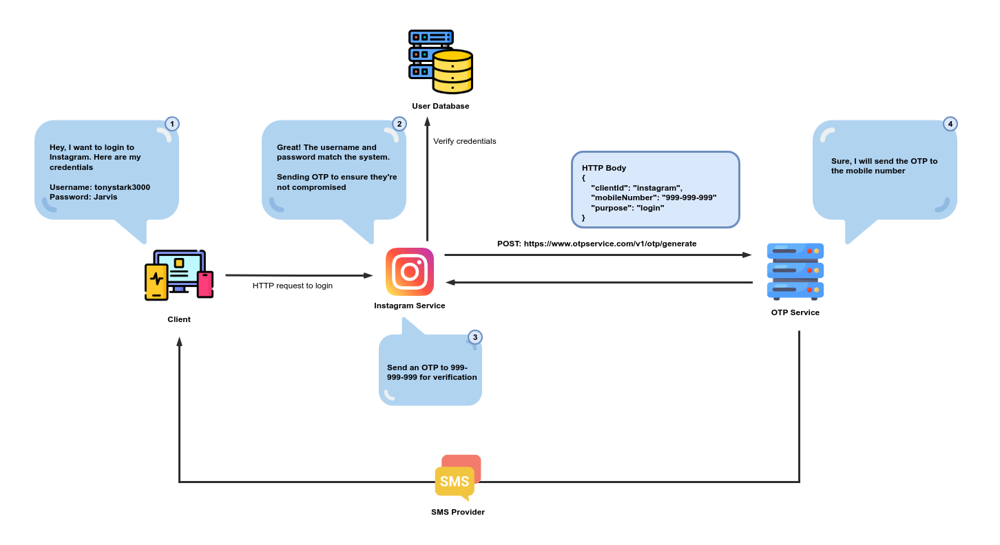

**HTTP Method**

This tells server what action to perform. In our case, we generate an OTP we use `POST` method. `POST` method is generally used when the action changes adds something new to the system. In this case, we create and store the OTP, we used `POST`

**Endpoint**

This tells the backend service (Ex: Instagram) where to route the request when an OTP has to be generated. We will use the endpoint `/v1/otp/generate`. Here `v1` means version 1 and is called API Versioning. API versioning allows you to make changes to your API without breaking existing clients by using version numbers like /v1/ or /v2/ in the URL path.

**HTTP Body**

Now we know `/v1/otp/generate`, generates the OTP. But the backend service need to provide information such as the user’s mobile number so that the OTP service can send the OTP via SMS after generating it. This information is sent as request body

```json
{
	"clientId": "instagram",
	"mobile": "999-999-999",
	"purpose": "login",
	"challengeId": "abcdef"
}
```

> Note that `challengeId` is also part of the generate OTP request. This is a special use-case where the user re-generates OTP for the same session.

OTP service can be used by any backend service (client) for OTP generation and validation. Hence the client has to pass its clientId with the OTP service for identifying the system that invokes it. This helps with things such as auditing, throttling when one client overloads the system with traffic, etc.

**HTTP Response**

After generating the OTP, the service generates the OTP and a unique challengeId to track the verification lifecycle. The challengeId is sent to the backend service so that it will be passed back with OTP during verification

```json
{
	"challengeId": "abcdef"
}
```

### Validate OTP

Now you receive the OTP via SMS and enter it into the OTP screen which sends the OTP to the OTP Service. The service validates if the OTP entered belongs to you. If yes, it allows you to access their account. If not, it says the OTP is invalid and asks ypu to enter the correct OTP again.

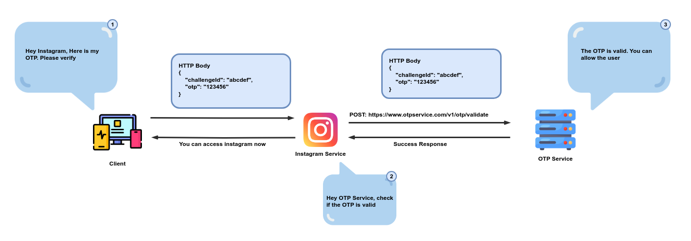

**HTTP Method**

`POST` is used because OTP verification is a non-idempotent operation that consumes the OTP and mutates verification state (attempt counters, invalidation).

**Endpoint**

This tells the backend service (Ex: Instagram) where to route the request when an OTP has to be generated. We will use the endpoint `/v1/otp/verify`

**HTTP Body**

We will pass the challengeId and OTP to the OTP service for verification

```json
{
	"challengeId": "abcdef",
	"otp": "123456"
}
```

**HTTP Response**

The OTP service returns either a success or failure response if the OTP is valid or invalid

```json
{
  "challengeId": "abcdef"
	"verificationStatus": "SUCCESS"
}
```

## High Level Design

### Generate OTP

When the backend service has to verify the user identity, the following steps are executed to generate and send the OTP to the user's mobile. Let's take the account login use-case as an example.

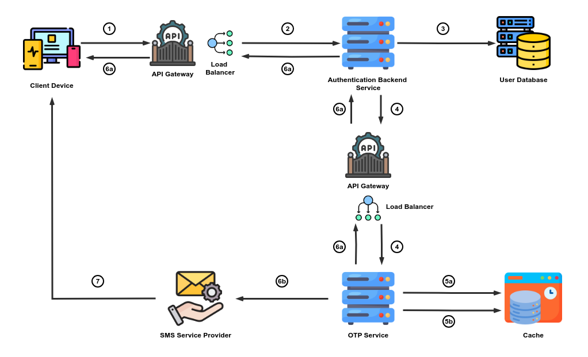

1. When the user enters their credentials to login to their account, the credentials are sent to the authentication backend service via a POST request.
2. The API Gateway of the service receives the request and routes it to the authentication backend service via load balancer.
3. The authentication backend service validates the credentials. If not valid, it sends a failure response; otherwise, it fetches the user's mobile number from the database and makes a POST call to the OTP service to generate an OTP.
4. The API Gateway of the OTP service receives the request and routes it to the OTP service via load balancer.
5. The OTP service has to perform two actions to serve the request.
	* (5a) **OTP Regenerate Flow:** The service first checks if a `challengeId` is included in the request. If found, it verifies whether the user still has generation attempts left (`generationAttemptsLeft`) for that session and it is within 10 minute window. If attempts remain, the system reduces the attempt count by one, creates a new OTP, and saves it following step (5b) below.
	* (5b) **OTP Generate Flow:** The OTP service generates a random 6-digit OTP using the OTP generation algorithm/logic and stores it in the cache with `validationAttemptsLeft` of 3, `generationAttemptsLeft` of 3, a TTL (Time-To-Live) of 10 minutes, and a random `challengeId` to track the session.
6. Once the OTP is generated, the OTP service perform 2 actions in parallel
	* (6a) The OTP service returns the `challengeId` to the authentication backend service which sends it back to the client
	* (6b) The OTP service sends the OTP and the user's mobile number to the SMS provider.
7. The SMS provider sends the OTP as an SMS to the user's mobile number.

**Why use cache instead of database to store OTP?**

OTPs by nature are short-lived codes, meaning they become obsolete after some time. Also, OTP is sensitive data, and there is no reason for someone to see it later.

Databases in general are used for long-lived persistent storage like user information, order history, payment transactions, etc. So, using databases for storing OTP doesn't make sense.

Cache naturally fits our use-case because the **OTP has to expire after 10 minutes**, and the **verification of OTP should be faster**. Almost all caching technologies such as Redis come with built-in TTL. When adding something to cache, we specify the TTL, and the entry is automatically removed from cache after the TTL expires. Also, caches are faster (1 - 3 ms) compared to databases (5 - 20 ms), and hence the OTP verification process will be faster. Additionally, we only need ~5GB of storage per day which makes cache a perfect choice.

**How does the OTP service track user-specific OTPs?**

Ever wondered how the OTP service knows which OTP belongs to a specific user's flow? 

Simple - it can be tracked using a random unique ID called the `challengeId` (challenging the user to prove their identity). When the OTP service generates an OTP, it also creates a unique challengeId which is sent to the backend service. The backend service returns the challengeId to the user's device while rendering the OTP page or screen. When the user enters the OTP, it's sent to the backend service along with the challengeId. The OTP service then checks if the challengeId + OTP combination received matches the one stored in the system.

**How OTPs are sent to user's mobile number?**

Sending OTPs to mobile number requires connecting with telecom carriers worldwide, which is an expensive and complex setup. So, we use third-party SMS services to send OTPs to mobile number. These SMS providers have already established relationship with these carriers and provide APIs for sending message globally.

For instance, [Twilio](https://www.twilio.com/en-us) is a popular third-party SMS service. After generating 6-digit OTP, the OTP service makes a call to Twilio's API with the user's mobile number and the OTP. Twilio identifies the telecom carrier for the number, routes the SMS through their network connections, and delivers it to the user's phone

### Verify OTP

The user receives the OTP via SMS, enters into the website for additional verification. The following steps explain the verification process.

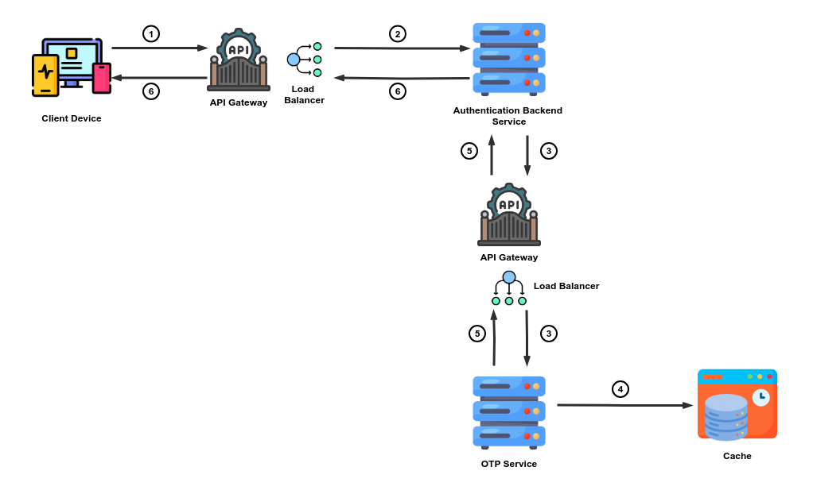

1. When the customer enters the OTP on the website, it is sent to the backend service via a POST request along with the `challengeId`.
2. The API Gateway of the service receives the request and routes it to the authentication backend service.
3. The authentication backend service sends the OTP to the OTP service for verification
4. The OTP service first checks whether the OTP has expired or the user has exceeded the maximum allowed attempts (`validationAttemptsLeft`). If the OTP has not expired and the limit hasn't been reached, it compares the submitted OTP against the one stored in cache. When both OTPs match, it sends a success response. However, if the user has exceeded the attempt limit, the OTP has expired or if the OTPs don't match, it sends a failure response.
5. The response from the OTP Service is sent back to the authentication backend service.
6. The authentication backend service returns the response to the client device

## Dive Deep Insights

### Cache Selection

We chose cache over database because OTPs are expected to be short-lived and should be invalidated or removed after the expired time. So, the most important requirement is built-in TTL (Time-To-Live) support. We also expect the retrieval to be faster and hence we can choose in-memory caches like Redis. Redis stores data in the RAM (memory) instead of disk for faster access.

But RAM is temporary memory. How to recover lost data in case of failures? In general OTP loss is acceptable because the user can always regenerate the OTP again. But if we still expect the availability to be high, the answer to his problem is **backup**. For example, Redis offers periodic backup options like **RDB (Redis Database) Snapshot** and **Append-Only File (AOF)**.

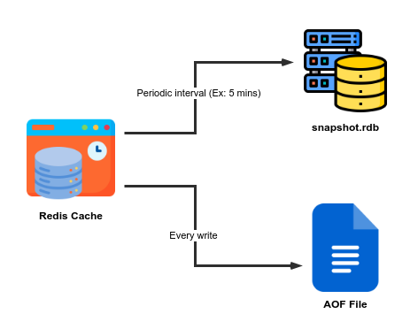
- In RDB snapshot, Redis periodically saves the snapshot of the cache at that point in time and writes it to the disk. In case of recovery after failure, Redis reconstructs the entries from the snapshot. One issue with this solution is that the snapshot happens at regular intervals (say 5 minutes) and if there are failures at the 3rd minute after the last backup, we lose that 3-minute data.
- In AOF method, all writes to Redis cache are persisted in an append-only file. So, in case of recovery after failure, Redis reconstructs all the entries from the file. This write happens in a separate thread so that the main thread is not blocked.

### OTP Storage Security

OTP is sensitive data and can be used against the actual user if it gets into the wrong hands, like attackers. So, it is not safe to store as plain text in the system. Since we store OTPs in cache, plain text OTPs can be exposed via log files, network interception of cache traffic, direct user access with admin permissions, etc. So, we will transform the plain text OTP into a secure hashed version so that it cannot be decoded and misused.

**One-way Hasing OTP**

A common approach is to hash OTPs using a one-way hash function like SHA-256. In one-way hash functions, you give an input and get an output. But you can never reverse the process to get the original input from the output. While this hides the original OTP, it is not sufficient for OTPs.

Why?
* OTPs are only 6 digits (000000–999999)
* That’s only 1 million possible values
* An attacker can easily generate all 1 million OTPs, hash them, and compare against stored hashes

This is called a brute-force attack, and fast hash functions like SHA-256 make it easier.

**Hashing OTP using HMAC (Hash-based Message Authentication Code)**

Think of normal hash function (SHA-256) as a juicer. You put fruits in and you get the juice out. You can't get the fruits back from the juice. Now think of HMAC as a juicer with a **secret lock**. Even if someone has the same fruit (OTP), they cannot make the same juice unless they have the **secret key**.


HMAC combines the OTP, a server-side secret key, and a hash function (Eg: SHA-256) to hash the OTP. Without the secret key, it is impossible to find the OTP from the hash.

### OTP In-transit Security

As the OTP service transmits the OTPs to SMS providers such as Twilio, the data travels over the internet and contains sensitive OTPs that needs protection. We accomplish this by utilizing HTTPS/TLS encryption on all API requests to the SMS service provider, to make sure that OTP is encrypted while being transmitted over the network.

HTTPS is the secure version of HTTP that encrypts data flowing between services, while TLS (Transport Layer Security) is the underlying encryption technology that makes HTTPS work. Think of TLS as creating a secure, encrypted tunnel through which data travels, so even if someone intercepts it, they can only see scrambled, unreadable information.

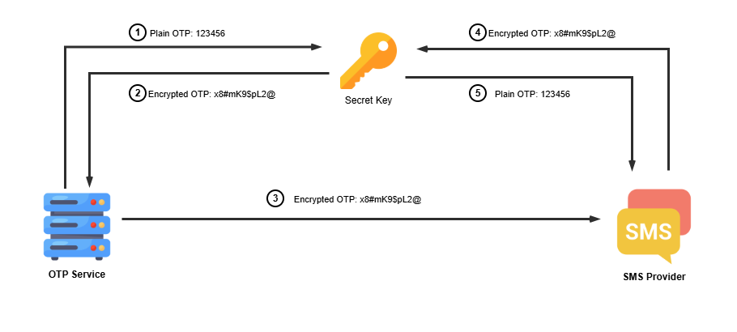

### High Availability

We expect the system to be highly available with an uptime of 99.9999% (we allow only 31.5 seconds of outage per year). There is no single solution to keep the system up throughout the year. We should combine multiple strategies discussed below to make our system resilient.

**Load Balancing**

A load balancer acts like a traffic controller that distributes requests across multiple servers to prevent any single server from getting overloaded. If there are 10 hosts, the load balancer checks if all 10 hosts are healthy. If some hosts are unhealthy, it doesn't send the request to those servers; instead, it sends requests to alternate healthy servers. We will place load balancers before the OTP Service to make sure the servers are not overloaded with requests. 

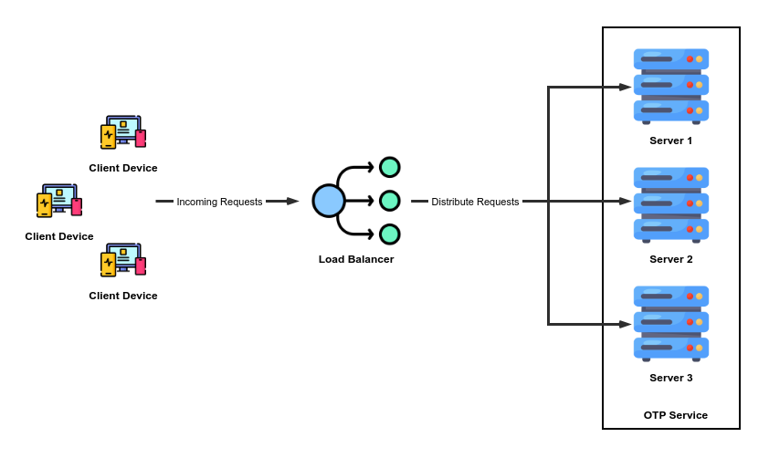

Some of the common load balancing strategies are discussed below:

1. Round Robin - Requests are distributed in order. For example, if there are 11 requests and 10 hosts, each host is given one request and finally the first host gets the 11th request
2. Least Connections - Requests are routed to the server that is currently serving fewer requests.
3. Weighted Routing - Send more traffic to powerful servers with more CPU and memory compared to the other servers.

**Multi-Region Deployment**

Ideally, the service will be deployed on a server placed in a data center in some part of the world. Assume the server is located in the USA. If the data center goes down due to unforeseen circumstances like power outage, natural calamity, or human error, there will be no server to serve the traffic for the OTP service. So, when building a resilient system, we should make sure the service is hosted in multiple physical locations (Ex: other regions like Europe, India, etc.) to consistently serve the traffic even if one data center is brought down due to issues.

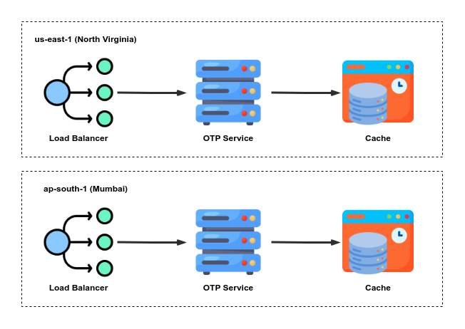

**Auto Scaling**

Auto Scaling automatically increases/decreases the number of servers based on traffic demand. It adds more servers (scale up) when the current servers can't handle the incoming traffic and removes servers (scale down) that are underutilized when traffic comes down. It monitors metrics like CPU, memory usage, etc. to decide if the current servers can handle the incoming traffic. This makes the service highly available to serve incoming traffic spikes without failing them.

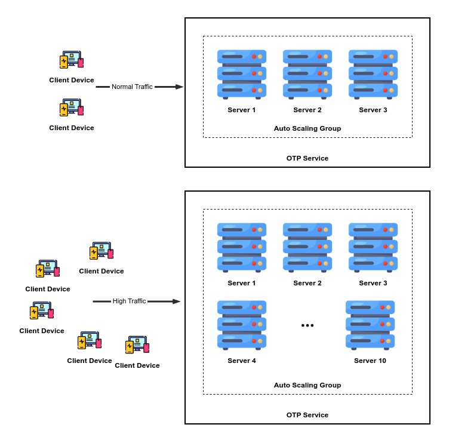

Note that Auto Scaling can also cause issues due to Denial of Wallet (DoW) attacks that target cloud services by generating massive traffic. As the system supports auto scaling, it keeps adding more and more hosts to handle the incoming traffic, resulting in over usage, thus increasing the infrastructure cost. So it is safer to set a upper threshold on the scaling limits like “don’t go beyond 100 servers”.


**Retry Mechanism**

Retry mechanisms automatically retry failed requests without failing the customer. This is very useful to handle transient failures such as network timeouts or temporary service unavailability. For example, in our use case, when the backend service invokes the OTP service to generate the OTP and fails due to transient failures, instead of failing the entire request, it retries generating the OTP 2-3 times.

But this retry mechanism makes the problem even worse if not handled properly. Assume we retry every 1 second in case of failures. This will overload the server more frequently that already couldn't handle the traffic. So, we use **exponential backoff**, a retry mechanism that retries after 1s, 2s, 4s, 8s, and so on (the delay increases exponentially). This gives the failed server ample time to come back to a healthy state.

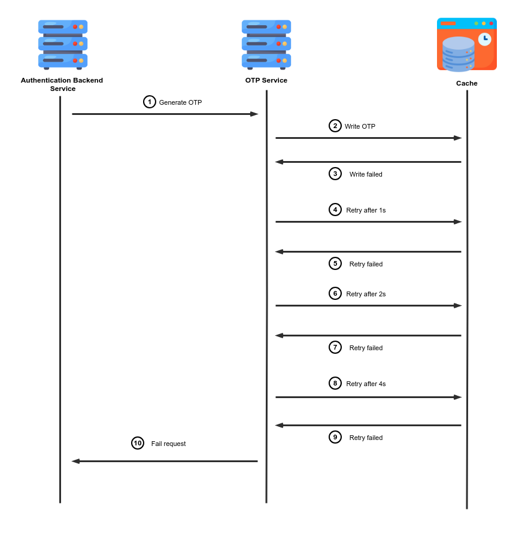

Exponential backoff also might overload the server because burst traffic is sent to the servers at exponential intervals. For example, if 1000 requests failed on a specific second, all these requests will be retried at seconds 2, 4, 8, and so on. This send burst traffic to the server recovering from outage. To avoid this, we add random delay called Jitter (Ex: random value between 0 to 0.5) to distribute the traffic. For instance, if there are 3 failed request, and the retry delay is 1 second, we add random jitter with the retry time to distribute the load, `req 1: 1 + 0.3s = 1.3s`, `req 2: 1 + 0.1s = 1.1s`, and `req 3: 1 + 0.2s = 1.2s`
