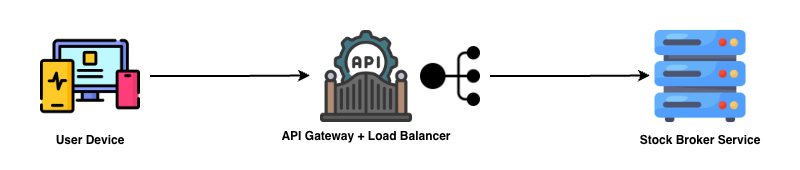
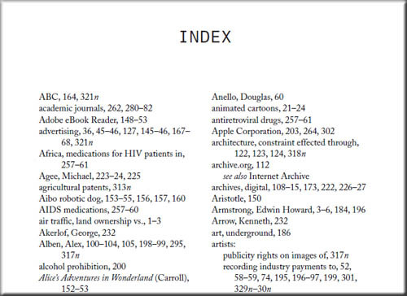
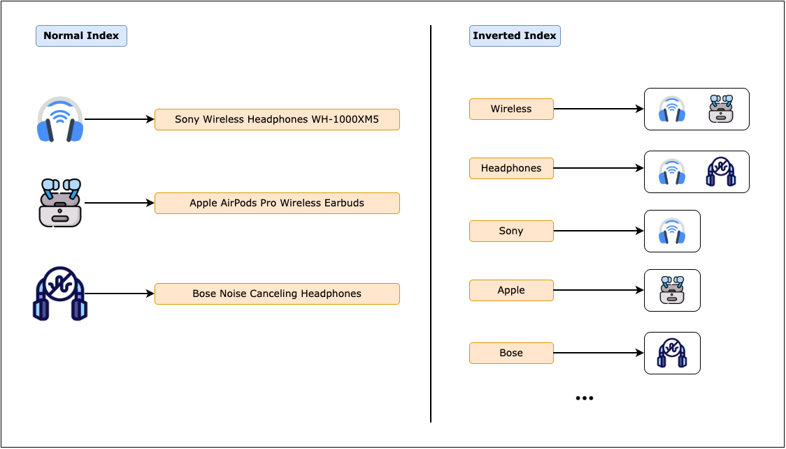
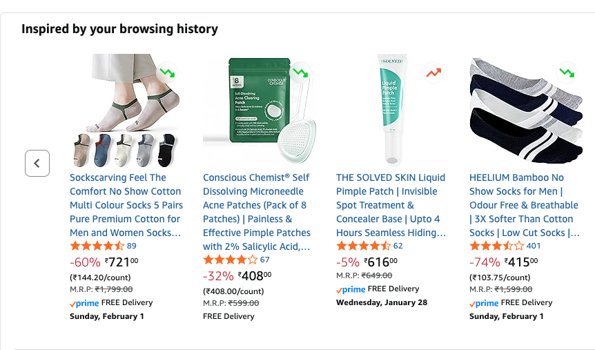
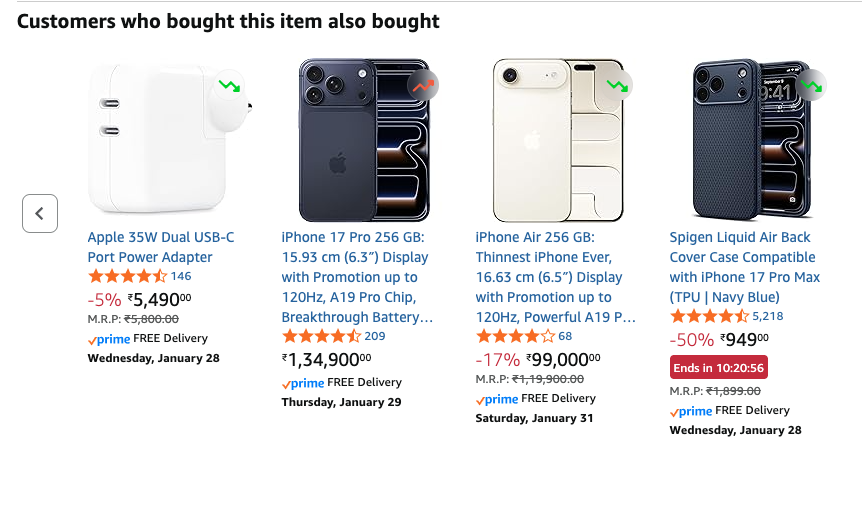

# Online Shopping Service

<!-- toc -->

- [Introduction](#introduction)
  * [What is an Online Shopping Service](#what-is-an-online-shopping-service)
  * [How Online Shopping Works](#how-online-shopping-works)
- [Requirements](#requirements)
  * [Functional Requirements](#functional-requirements)
  * [Non-Functional Requirements](#non-functional-requirements)
- [API Design](#api-design)
  * [Product Recommendations](#product-recommendations)
  * [Product Search](#product-search)
  * [Cart Management](#cart-management)
  * [Checkout](#checkout)
  * [Order Tracking](#order-tracking)
- [High Level Design](#high-level-design)
  * [Note](#note)
  * [Recommendations Flow](#recommendations-flow)
  * [Product Search Flow](#product-search-flow)
  * [Cart Management Flow](#cart-management-flow)
  * [Checkout Flow](#checkout-flow)
  * [Order Tracking Flow](#order-tracking-flow)
- [Deep Dive Insights](#deep-dive-insights)
  * [Database Selection](#database-selection)
  * [Database Modelling](#database-modelling)
  * [Search Algorithm](#search-algorithm)
  * [Inventory Consistency](#inventory-consistency)
  * [Recommendation Engine](#recommendation-engine)

<!-- tocstop -->

## Introduction
### What is an Online Shopping Service
Imagine a supermarket. You walk through the store, see different products, pick products, add them to your shopping cart, and go to the counter for checkout. 
At the counter, the cashier scans your items, accepts you payment and give you a receipt. After you leave, you can use the receipt to return your products if needed.


An online shopping works the same way. The only difference is that everything happens digitally through internet. 
Instead of going to a physical store, you go to an online shopping website/app to browse and purchase the products you need. Similar to a physical shopping cart, the online store provides a digital cart where you can add the items you like and pay digitally using you Card, UPI, etc. Like the cashier, the backend system performs several tasks such as checking for inventory, handling payment, and generating receipt. Once your order is placed, you can track the status of the order until it reaches

### How Online Shopping Works
In an online shopping store, you search for the product you like to buy (Ex: sport shoes). The backend system runs a search algorithm to fetch and display all the results matching your description. The result includes different brands, shoe colors, and sizes. You pick the one you like and add it to the cart. During checkout, the backend system collects your address and process the payment through payment gateway. After placing the order, the system sends you regular updates about the delivery. The backend system remembers the products you viewed and purchased, and starts recommending similar products you might be interested in.


There are multiple systems involved within the online shopping system to provide the best shopping experience for the customers:
* Search Service - Fetch and display the product results matching the customer's description
* Cart Management Service - Manages the item added to the shopping cart.
* Payments Service - Securely handles the online payments
* Order Management Service - Place and track customer orders
* Recommendation Service - Provide recommendations to customers based on their preferences.

---

## Requirements
### Functional Requirements
In an ideal online shopping scenario, the user goes through a sequence of flows to purchase a product. The functional requirements are derived from this user journey.


> We ignored the "Detail Page" flow in this design as it is a simple API to display the details of the product.

* **Search products:** Users should be able to search for products using keywords.
* **Add items to cart:** Users should be able to add products to their cart.
* **View cart:** Users should be able to view all items in their cart with price, quantity, and total cost.
* **Checkout and place order:** Users should be able to place an order with selected items and complete the payment.
* **Track order status:** Users should be able to view order status and track shipment progress.
* **View recommendations:** Users should receive personalized recommendations based on browsing and order history.

### Non-Functional Requirements
* **Low latency:** Search results should be returned within 100 ms.
* **High availability:** The service should remain available (99.99 %) during peak shopping events like Black Friday and Prime Day.
* **Strong consistency:** Inventory must be strongly consistent to prevent overselling.
* **Security:** User data, payment information, and order details must be encrypted and protected.
* **Scalability:** The system should scale automatically to handle traffic spikes (10000+ TPS) during sales and promotional events.

---

## API Design
### Product Recommendations
Recommendations allows the users to discover products they might be interested in based on their browsing history, and past purchases.

This API retrieves personalized product recommendations for a user.


**HTTP Method & Endpoint**

We use `GET` method since we are retrieving recommendation data. The endpoint would be `/v1/recommendations`.

**Query Parameters**

```
GET /v1/recommendations?limit=10
```

- `limit` - Number of recommendations to return (optional, default: 10)

**HTTP Response**

```json
{
  "recommendations": [
    {
      "productId": "prod_11111",
      "name": "Apple AirPods Pro (2nd Gen)",
      "price": 249.99,
      "rating": 4.9,
      "imageUrl": "https://cdn.shopping.com/images/prod_11111.jpg",
      "reason": "Based on your recent views"
    },
    {
      "productId": "prod_22222",
      "name": "Bose QuietComfort 45",
      "price": 329.99,
      "rating": 4.7,
      "imageUrl": "https://cdn.shopping.com/images/prod_22222.jpg",
      "reason": "Customers who bought Sony headphones also bought this"
    },
    {
      "productId": "prod_33333",
      "name": "Anker USB-C Charging Cable",
      "price": 14.99,
      "rating": 4.6,
      "imageUrl": "https://cdn.shopping.com/images/prod_33333.jpg",
      "reason": "Frequently bought together"
    }
  ]
}
```

### Product Search
Product search allows the customers to search for the product they are interested in. For example, the customer enters keywords like "wireless headphones" and the system returns the relevant products. The search also supports adding filters like brand, price range, ratings. It also supports sorting options like price, ratings, etc.

This API allows users to search for products using keywords and apply filters and sorting.


**HTTP Method & Endpoint**

This tells the server what action to perform. We use the `GET` method as we want to search the product with the given criteria. The `GET` method is used for read-only operations that don't alter system state. We will use the endpoint `/v1/products/search`. Here, `v1` means version 1 and is called API versioning. API versioning allows you to make changes to your APIs without breaking existing clients by using version numbers like `/v1/` or `/v2/` in the URL path.

**Query Parameters**

Since this is a `GET` request, search criteria are passed as query parameters in the URL rather than in the request body.

```
GET /v1/products/search?
  q=wireless+headphones
  &category=electronics
  &minPrice=50
  &maxPrice=200
  &brand=Sony
  &sort=price_asc
  &page=1
  &limit=20
```

- `q` - The search keyword or phrase
- `category` - Filter by product category (optional)
- `minPrice` - Minimum price filter (optional)
- `maxPrice` - Maximum price filter (optional)
- `brand` - Filter by brand name (optional)
- `sort` - Sorting criteria: `relevance`, `price_asc`, `price_desc`, `rating`, `newest` (optional, default: `relevance`)
- `page` - Page number for pagination (optional, default: 1)
- `limit` - Number of results per page (optional, default: 20)

**HTTP Response**

The server returns a list of products matching the search criteria along with pagination metadata.

```json
{
  "products": [
    {
      "productId": "prod_12345",
      "name": "Sony WH-1000XM5 Wireless Headphones",
      "description": "Industry-leading noise canceling headphones",
      "price": 399.99,
      "brand": "Sony",
      "rating": 4.8,
      "reviewCount": 2547,
      "imageUrl": "https://cdn.shopping.com/images/prod_12345.jpg",
      "inStock": true,
      "availableQuantity": 145
    },
    {
      "productId": "prod_67890",
      "name": "Sony WF-1000XM4 Wireless Earbuds",
      "description": "True wireless earbuds with exceptional sound",
      "price": 279.99,
      "brand": "Sony",
      "rating": 4.7,
      "reviewCount": 1823,
      "imageUrl": "https://cdn.shopping.com/images/prod_67890.jpg",
      "inStock": true,
      "availableQuantity": 89
    }
  ],
  "pagination": {
    "currentPage": 1,
    "totalPages": 15,
    "totalResults": 287,
    "hasNext": true
  },
  "filters": {
    "availableBrands": ["Sony", "Bose", "Apple", "Samsung"],
    "priceRange": {
      "min": 29.99,
      "max": 549.99
    }
  }
}
```

### Cart Management
The shopping cart allows the users to add their items they want to buy. Users can add items, remove items, update quantities, and view their cart contents before proceeding to checkout.

> By default, a cart is created for a customer when they sign up on the shopping website. Therefore, there is no API to explicitly create a cart. However, the API design is extensible and can support multiple carts in the future by distinguishing carts using a `cartId`.

#### View Cart

This API fetches all the items currently added to the user's cart.


**HTTP Method & Endpoint**

We use the `GET` method since we are only retrieving information. The endpoint would be `/v1/cart/{cartId}`. We only pass `cartId` in the parameter which is
sufficient to fetch cart information.

**HTTP Response**

```json
{
  "cartId": "cart_789",
  "items": [
    {
      "cartItemId": "item_001",
      "productId": "prod_12345",
      "name": "Sony WH-1000XM5 Wireless Headphones",
      "price": 399.99,
      "quantity": 2,
      "imageUrl": "https://cdn.shopping.com/images/prod_12345.jpg",
      "inStock": true,
      "subtotal": 799.98
    },
    {
      "cartItemId": "item_002",
      "productId": "prod_98765",
      "name": "Samsung Galaxy Buds Pro",
      "price": 199.99,
      "quantity": 1,
      "imageUrl": "https://cdn.shopping.com/images/prod_98765.jpg",
      "inStock": true,
      "subtotal": 199.99
    }
  ],
  "summary": {
    "subtotal": 999.97,
    "tax": 79.99,
    "shipping": 0.00,
    "total": 1079.96,
    "itemCount": 3
  }
}
```

#### Add Items to Cart

This API allows users to add a product and the quantity to their shopping cart.


**HTTP Method & Endpoint**

We use `POST` method because adding an item to the cart creates a new entry in our system. The endpoint would be `/v1/cart/{cartId}/items`. We are using the `/v1/cart/{cartId}/items` instead of `/v1/cart/{cartId}` because, we are adding/modifying items in the cart, not the cart itself (like changing cart status or metadata).

**HTTP Body**

```json
{
  "productId": "prod_12345",
  "quantity": 2
}
```

**HTTP Response**

```json
{
  "cartId": "cart_789",
  "cartItemId": "item_001",
  "productId": "prod_12345",
  "status": "success",
  "message": "Item added to cart successfully",
  "cartItemCount": 3
}
```

#### Update Item Quantity
This API allows users to modify the quantity of items already present in the cart. 

> Note: Setting the quantity to `0` is considered removing the item from the cart.


**HTTP Method & Endpoint**

We use `PATCH` method for this API because it updates only a specific field (quantity) of an existing 
item without replacing the entire item. The endpoint would be `/v1/cart/{cartId}/items/{itemId}`

**HTTP Body**
```json
{
  "quantity": 3
}
```

**HTTP Response**
```json
{
  "cartId": "cart_789",
  "cartItemId": "item_001",
  "productId": "prod_12345",
  "status": "success",
  "message": "Cart item quantity updated successfully",
  "cartItemCount": 4
}
```

### Checkout

Checkout is the process where the users confirms their purchase. The user selects their delivery address and the payment method for checkout. 
The system checks inventory, reserve products, processes payment, and creates an order.

This API allows users to place an order with items from their cart.


**HTTP Method & Endpoint**

We use the `POST` method because placing an order creates a new order record in the system. The endpoint would be `/v1/orders`.

> 

**HTTP Body**

```json
{
  "cartId": "cart_789",
  "shippingAddressId": "address_123",
  "paymentMethodId": "payment_xyz"
}
```

**HTTP Response**

```json
{
  "orderId": "order_54321",
  "status": "ORDER_PLACED",
  "estimatedDelivery": "2026-01-30",
  "total": 1079.96,
  "message": "Order placed successfully"
}
```

### Order Tracking

This API allows the users to track the current status of their order.


**HTTP Method & Endpoint**

We use the `GET` method since this is a read-only operation. The endpoint would be `/v1/orders/{orderId}`.

**HTTP Response**

```json
{
  "orderId": "order_54321",
  "status": "SHIPPED",
  "placedAt": "2026-01-26T14:32:00Z",
  "items": [
    {
      "productId": "prod_12345",
      "name": "Sony WH-1000XM5 Wireless Headphones",
      "quantity": 2,
      "price": 399.99
    }
  ],
  "shippingAddress": {
    "name": "John Doe",
    "street": "123 Main Street",
    "city": "Seattle",
    "state": "WA",
    "zipCode": "98101"
  },
  "tracking": {
    "carrier": "UPS",
    "trackingNumber": "1Z999AA10123456784",
    "estimatedDelivery": "2026-01-30",
    "currentLocation": "Seattle Distribution Center",
    "history": [
      {
        "status": "ORDER_PLACED",
        "timestamp": "2026-01-26T14:32:00Z",
        "location": "Online"
      },
      {
        "status": "PAYMENT_PROCESSED",
        "timestamp": "2026-01-26T14:32:15Z",
        "location": "Payment Gateway"
      },
      {
        "status": "SHIPPED",
        "timestamp": "2026-01-27T09:15:00Z",
        "location": "Fulfillment Center - Tacoma, WA"
      }
    ]
  },
  "payment": {
    "subtotal": 999.97,
    "tax": 79.99,
    "shipping": 0.00,
    "total": 1079.96,
    "paymentMethod": "CREDIT_CARD ending in 4242"
  }
}
```

## High Level Design

Before diving deep into the high-level design of each component, we will first understand the different services involved in an online shopping system.

* **API Gateway** - The entry point for all client requests, handles routing, authentication, and rate limiting.
* **Order Service** - Receives the customer order and executes it.
* **Cart Service** - Provides the details of the customer's cart such as items, and quantities.
* **Inventory Service** - Checks item availability and temporarily reserves item for the customer's order.
* **Fulfillment Service** - Handles the actual delivery of items in the customer's order.
* **Address Service** - Provides the address of the customer to ship order
* **Payment Service** - Deducts money from the customer's payment method.
* **Notification  Service** - Sends order confirmation/failure notification to the customers.
* **Recommendation Service** - Shows recommendations for customers in the landing page.
* **Product Search Service** - Fetch and return products based on customers search query.

### Note

Throughout this high-level design, we will discuss several backend services such as 
the Order Service, Inventory Service, Cart Service, etc. In a real system, each service typically sits behind an **API Gateway and a Load Balancer**, which receive incoming requests and route them to the appropriate backend servers. To keep the diagrams simple, I haven't shown these components explicitly, but you can assume they exist in front of every backend service.



### Recommendations Flow

The recommendations are shown on the landing page (home page) of the website. 
It shows personalized product suggestions to help users discover items they might like. 
In general, recommendations are shown based on data such as user's behavior, purchase history, etc. Recommendation system consists of two flows:
1. **Recommendation Generation**: Customer data is analyzed to generate recommendations
2. **Recommendation Retrieval**: Customer's recommendation is fetched and shown on their landing page.

#### Challenges of Recommendation Generation
For an online shopping system with millions of customers, it is resource-intensive to precompute and persist recommendations for all the users. To avoid resource wastage, the customers can be split into two pools: 1) **Hot pool**, and 2) **General pool**

1. **Hot-pool customers** are those who visit the shopping website or app on regular basis. For these users, recommendations can be precomputed and persisted because the probability of revisit is high. Identification of hot users can be based on weighted activity, where recent visits, searches, cart additions, and purchases contribute differently to an activity score.
2. **General-pool customers** are those who have infrequent visits. Since their activity is low, the system can show recommendations based on trending products or compute recommendations on demand when they return to the shopping website or app.

#### Recommendation Generation (Batch Processing)


1. Every night (or on a fixed schedule), a batch job runs in the **Recommendation Service** to generate recommendations for hot pool users.
2. The **Recommendation Service** fetches user activity data from the **User Activity Database** and past purchases from the **Order Database**. User activities include their search queries, product views, cart additions, etc,
3. The service also fetches product metadata from the **Product Catalog Database**, including categories, brands, descriptions, and attributes.
4. The **Recommendation Service** runs machine learning models (collaborative filtering, content-based filtering, etc) to compute personalized recommendations for each user. Refer [Recommendation Engine](#recommendation-engine) section for more details
5. The generated recommendations are stored in a **Recommendations Cache** (like Redis) with a TTL (Ex: 24 hours) for fast retrieval.

#### Recommendation Retrieval (Real-time)


1. When the user visits the landing page, a request (`GET /v1/recommendations`) is sent to the Recommendation Service to fetch the latest recommendations.
2. The API Gateway of the shopping service receives the request and routes it to the *Recommendation Service**.
3. The **Recommendation Service** checks if the user is part of hot pool via the **Hot pool User Cache**
4. For hot pool users, the **Recommendation Service** checks the **Recommendations Cache** for pre-computed recommendations for this user. If recommendations are found in the cache (cache hit), they are returned (Step 4a). On cache miss, the **Recommendation Service** falls back to location-based trending products fetched from **Trending Product Cache** (Step 4b). Trending data is cached because it changes infrequently and is read frequently, allowing low-latency access.
5. For general pool users, the **Recommendation Service** performs online inference on the ML model with the necessary context such as user activity, product, and order to provide on-the-fly recommendations.
6. The recommendations are returned to the user's device and displayed on the page.

### Product Search Flow
The product search flow allows users to find the products using keywords, filters, and sorting options. 
The search engine indexes millions of products efficiently and returns the relevant search results in milliseconds.


1. The user enters a search query like "wireless headphones" in the search bar on the mobile app or the website.
2. The request reaches the **API Gateway** of the shopping service, which routes the request to the **Product Search Service**.
3. The **Product Search Service** queries the **Search Index** (powered by Elasticsearch or similar technology) to fetching matching products. The search index stores pre-processed product data optimized for fast retrieval. It uses an inverted index structure where each word points to all products containing that word. Refer [Search Algorithm](#search-algorithm) section for more details.
4. The search engine calculates a **relevance score** for each product based on factors like keyword matching, popularity, ratings, and user preferences. Products are ranked by this score.
5. If the user has applied filters such as price range, brand, ratings, the search engine applies these filters to narrow down results.
6. If the user selected sorting options like price low to high, newest arrivals, the results are sorted accordingly.
7. The user activity is pushed to the `User Activity Stream` for tracking user behaviour. We use stream to track user activity instead of adding an entry directly in the user activity database. This is done to avoid latency due to database write that can slow down the search experience.
8. The search service returns paginated results to the API Gateway, which sends them back to the user's device.


**Async Updates**

9. The `User Activity Data Service` consumes the user activity events from `User Activity Stream` (Step 9a) and performs necessary operations and persist in the `User Activity Database` (Step 9b)
10. We store the product and inventory info in elastic search index. So, it might get outdated when the actual product and inventory information changes. So, all updates to product and inventory data are published to streams `Catalog Update Stream` and `Inventory Update Stream` respectively.
    * The `Elastic Search Updater Service` reads the catalog update details from `Catalog Update Stream` (Step 10a) and inventory update details from `Inventory Update Stream` (Step 10b).
    * The service then updates the elastic search index with the updated infromation (Step 10c)

> For updating the index the `Elastic Search Updater Service` didn't read the data from Catalog or Inventory database. This is because we made the events `rich`, meaning the update data itself is added to the event. This avoids load to the actual databases.

### Cart Management Flow
The cart management flow allows users to add products to their cart, update quantities, remove items, and view cart contents before checkout.


#### 1. View Cart Flow

1. The user navigates to the cart page by clicking the cart icon. The request (`GET /v1/cart/{cartId}`) reaches the **API Gateway**. 2
2. The **API Gateway** routes the request to the **Cart Service**. 
3. The **Cart Service** retrieves all cart items for the user from the **Cart Database**. 
4. For each cart item, the **Cart Service** fetches the latest product details (price, name, image) from the **Product Catalog Cache** to ensure prices are up-to-date. 
5. The **Cart Service** also verifies stock availability for each item by calling the **Inventory Service**. If any item is out of stock, it's flagged in the response so the user can remove it before checkout. 
6. The **Cart Service** calculates the subtotal, estimated tax, and total cost. 
7. The cart details are returned to the user's device and displayed on the cart page.

#### 2. Add to Cart Flow

1. The user clicks the "Add to Cart" button on a product page. The request (`POST /v1/cart/{cartId}/items`) reaches the **API Gateway** with the user ID, product ID, and desired quantity.
2. The **API Gateway** routes the request to the **Cart Service**. 
3. The **Cart Service** first checks if the product is in stock by querying the **Inventory Service**.
4. The **Cart Service** adds the item to the user's cart in the **Cart Database**.

#### 3. Update Item Quantity Flow

1. The user modifies the quantity of items in the cart. The request (`PATCH /v1/cart/{cartId}/items/{itemId}`) reaches the **API Gateway** with the user ID, product ID, and desired quantity.
2. The **API Gateway** routes the request to the **Cart Service**.
3. The **Cart Service** first checks if the sufficient quantities are available in stock by querying the **Inventory Service**.
4. The **Cart Service** updates the item quantity in the **Cart Database**.

### Checkout Flow
The Order/checkout flow is treated as an **coordinated operation**: inventory reservation, payment processing, and order creation must either all succeed or all fail as a single logical unit. If any step fails, the system executes compensation actions (e.g., releasing reserved inventory, issuing refunds) to maintain consistency. This follows the [Saga design pattern](https://learn.microsoft.com/en-us/azure/architecture/patterns/saga).


#### 1. Checkout Initiation
1. The user goes to the checkout page, confirms shipping address and payment method, clicks **Place Your Order**. The client sends `POST /v1/orders` request with cart ID, address ID, and payment method ID.
2. The **API Gateway** of the shopping service authenticates the user and routes the request to the **Order Service**.
3. The **Order Service** creates an order entry in the **Order Database** with the `PAYMENT_PENDING` state.

#### 2. Cart Validation & Inventory Reservation 
1. The **Order Service** invokes the **Cart Service** to fetch the cart items. The Cart Service fetches the data from **Cart Database** and return them.
2. The **Order Service** requests the **Inventory Service** to reserve stock for all the cart items.
3. The **Inventory Service** locks (reserves) the quantities for the cart items so that no other customer can buy them until this order is created/failed. 
For example, If 5 units of an item are available and a customer reserves 3 during checkout, only the remaining 2 units are available for other customers.
    * The inventory is usually reserved with a TTL (Ex: 10 mins) to avoid reserving the inventory indefinitely if the customer abandons checkout or service crash. A background job periodically releases expired reservations back to available stock.
4. If any item is unavailable, the reservation fails and checkout is aborted.

#### 3. Payment Processing & Order Creation
1. Once inventory is successfully reserved, the **Order Service** initiates the payment by invoking the **Payment Service** with the customers payment method ID. The Payment Service talks to the bank to
deduct money from the customer's account. In most cases, OTP authentication is required. In such case, the Payment Service redirects the customers to the bank page to enter the OTP.
2. If the payment fails:
   * The order entry in the **Order Database** is updated with the status `CONFIRMED`
   * Reserved inventory is immediately released.
3. If the payment succeeds:
   * The order entry in the **Order Database** is updated with the status `FAILED`
   * Reserved inventory is converted to committed sales and the quantities are decremented from available stock.

#### 4. Post-Order Flow
1. The **Order Service** invokes the **Cart Service** to clear the cart.
2. It publishes the `Order Placed` event to the **Order Events Stream**. This is done so that interested services can receive the order event and perform the necessary action.
3. The **Fulfillment Service** consumes the event via **Fulfillment Queue** and begins picking, packing, and shipping.
4. The **Notification Service** consumes the event via **Notification Queue** to send order confirmation to the customer.
5. The **Notification Service** sends the order details to the customer via SMS, email, and push notification (app).
6. Finally, the order service, shows the order confirmation status to the customer.

#### How the items are reserved during checkout
The inventory data are stored in the inventory database. Each entry of the database will have the item ID, item Name, and its available quantity.
During checkout, the inventory service blocks that items being checked out so that others cannot order the same item. There are multiple approaches
available such as optimistic and pessimistic locking to reserve items. To learn more about inventory reservation refer section [Inventory Consistency](#inventory-consistency).

### Order Tracking Flow
After the order is placed, users want to track the delivery status. The tracking flow provides real-time status updates.


1. The user clicks "Track Order" on the order confirmation page or navigates to "My Orders". The request (`GET /v1/orders/{orderId}`) reaches the **API Gateway** of the shopping service.
2. The **API Gateway** routes the request to the **Order Service**.
3. The **Order Service** fetches the order details from the **Order Cache**, including status, items, shipping address, and payment summary. The cache is updated when the data is updated in the **Order Database**
4. The **Order Service** returns order and tracking data to the user's device.

**Async Tracking Updates**
  * Whenever there is an update in the order tracking (Step A), the **Fulfillment Service**, pushes the event to `Order Tracking Stream` (Step B)
  * The **Order Service** consumes the event and update the order and tracking details in **Order Database** (Step C)
  * When order details are updated, the data is update in the **Order Cache** (Step D)

---

## Deep Dive Insights
### Database Selection
We cannot make a "single database" choice for the entire online shopping system. Each functionality of the system will have a specific database choice based on the requirement.

> These are general guidelines to build intuition, not absolute rules. The right choice always depends on the specific access patterns, scale, and consistency requirements.

| Guideline                                                     | Recommendation       |
|---------------------------------------------------------------|----------------------|
| When eventual consistency is not accepted                     | Use SQL (Relational) |
| When eventual consistency is accepted                         | Use NoSQL            |
| When you need faster access                                   | Prefer NoSQL         |
| When data correctness is critical (no partial failures)       | Use SQL              |
| When row-level locking is required to block concurrent writes | Use SQL              |
| When it is read-heavy                                         | Prefer NoSQL         |
| When you have simpler queries                                 | NoSQL works well     |

Based on the above guidelines, we made the database choices for our online shopping
service.
<table>
    <tr>
        <th>Database</th>
        <th>Deciding Factors</th>
        <th>Decision</th>
    </tr>
    <tr>
        <td>Product Catalog DB</td>
        <td>
            <ul>
                <li><b>Read-Heavy Data</b> – Product details are read far more often than updated.</li>
                <li><b>Non-Critical Consistency</b> – Slight delays in reflecting updates are acceptable.</li>
                <li><b>High Scalability</b> – Must support millions of concurrent product views.</li>
            </ul>
        </td>
        <td>NoSQL (Document)</td>
    </tr>
    <tr>
        <td>Inventory DB</td>
        <td>
            <ul>
                <li><b>Concurrent Checkouts</b> – Multiple users may attempt to buy the same item.</li>
                <li><b>Strong Consistency</b> – Stale data can cause overselling.</li>
                <li><b>Locking / Versioning</b> – Requires optimistic or pessimistic locking.</li>
                <li><b>Atomic Updates</b> – Quantity updates must be all-or-nothing.</li>
            </ul>
        </td>
        <td>Relational (ACID)</td>
    </tr>
    <tr>
        <td>Cart DB</td>
        <td>
            <ul>
                <li><b>High Read & Write Throughput</b> – Frequent updates during browsing.</li>
                <li><b>Eventual Consistency Acceptable</b> – Cart is revalidated at checkout.</li>
            </ul>
        </td>
        <td>NoSQL (Key–Value / Document)</td>
    </tr>
    <tr>
        <td>Order DB</td>
        <td>
            <ul>
                <li><b>Financial Source of Truth</b> – Represents confirmed purchases.</li>
                <li><b>Atomic Order Creation</b> – Order, payment status, and totals must be consistent.</li>
            </ul>
        </td>
        <td>Relational (ACID)</td>
    </tr>
    <tr>
        <td>Fulfillment DB</td>
        <td>
            <ul>
                <li><b>Workflow State Management</b> – Tracks shipment lifecycle (packed, dispatched, delivered, returned).</li>
                <li><b>Moderate Consistency Needs</b> – Updates must be reliable but can be asynchronous across services.</li>
            </ul>
        </td>
        <td>No SQL</td>
    </tr>
    <tr>
        <td>User Activity DB</td>
        <td>
            <ul>
                <li><b>Write-Heavy Stream</b> – Massive volume of events (views, searches, clicks).</li>
                <li><b>Append-Only Pattern</b> – Historical logs are rarely updated or deleted.</li>
                <li><b>Eventual Consistency</b> – Slight delays in aggregation are acceptable.</li>
            </ul>
        </td>
        <td>NoSQL (Wide-Column / Time-Series)</td>
    </tr>
</table>

### Database Modelling
#### Product Catalog Schema


* Database Type: NoSQL (Document Store)
* Common Queries:
    * Fetch product details by `productId`
    * Fetch products by category or brand
* Indexing: `productId`, `category`, `brand`

#### Inventory Schema


* Database Type: Relational Database
* Common Queries:
    * Read available quantity during checkout
    * Reserve and decrement inventory atomically
* Indexing: `productId`

#### Cart Schema

* Database Type: NoSQL (Key-Value / Document Store)
* Common Queries:
    * Read cart by `cartId`
    * Add, update, or remove cart items
* Indexing: `cartId`, `userId`

#### Order Schema

* Database Type: Relational Database
* Common Queries:
    * Fetch order details by `orderId`
    * Fetch all orders of a user by `userId`
* Indexing: `orderId`, `userId`

#### Fulfillment Schema

* Database Type: Relational Database
* Common Queries:
    * Fetch fulfillemnt details by `orderId`
* Indexing: `orderId`

#### User Activity Schema

* Database Type: Relational Database
* Common Queries:
    * Fetch all activities of user by `userId`
    * Fetch all activities of user by `userId` of a specific `type` (Ex: PRODUCT_VIEW)
* Indexing: `userId`, `type`

### Search Algorithm

Search is the important entry point to sales in an online shopping platform. Most users know the items they like to purchase and search them in the website/app. A fast, accurate search engine can improve the user experience and conversion rates. But building a search system that handles millions of products and returns relevant results in milliseconds is challenging.

Imagine there are 100 million products in the database, and a user searches for "wireless headphones". If we query the database directly using `SELECT * FROM products WHERE name LIKE '%wireless%' OR description LIKE '%headphones%'`, the database would scan every single row, which takes several seconds. The solution is to build a **search index**. 

#### Inverted Index

Think of it like an index at the back of a textbook. Instead of reading every page to find mentions of "wireless", we flip to the index, which tells exactly which pages contain that word.



Search engines like Elasticsearch use an **inverted index** data structure. Instead of mapping **product id to product name**, it maps **word to list of product ids"



When a user searches for "wireless headphones", the search engine look up both words in the index: `wireless → [prod_001, prod_002]`, and
`headphones → [prod_001, prod_003]`. The intersection of these lists gives products that contain **both** words. In this case, `prod_001` contains both the words `wireless` and `headphones`.

When a new product is added to the catalog, the search engine processes it through several steps:

1. **Tokenization** - The item name and description are split into a list of words, or tokens. For instance, "Sony Wireless Headphones" turns into [ "Sony", "Wireless", "Headphones"].
2. **Normalization** - Convert the words to lowercase and remove any special characters. For example, "Headphones" turns into "headphones".
3. **Stemming** - This step reduces words to their root form. For example, "running" become "run," and "headphones" become "headphone." That way, when a user searches for "headphone," we will also provide the results of "headphones."
4. **Remove Stop Words** - Remove common words like "the", "a", "and" that don't add search value.
5. **Indexing** - Add the tokens processed to the inverted index and map every token with the Product ID.


### Inventory Consistency

Inventory consistency is one of the critical challenges in e-commerce. Overselling of products (selling more items than available) lead to customer dissatisfaction, order cancellations, and revenue lost. But maintaining consistency when thousands of users are trying to buy the same popular product at the same time is very difficult.

Assume there is only 1 iPhone 15 Pro left in stock. At the exact same time, two customers (Customer A and Customer B) add the iPhone to their cart and proceed to checkout. Lets say both the Customer A and Customer B places the order at the same time. Assume both the orders execute at the same time, both order gets placed but only one customer gets the product delivered and the other customers order get cancelled. This is called a **race condition** - two concurrent transactions read the same data and make decisions based on stale information.

#### Pessimistic Locking

Pessimistic locking prevents race conditions by locking the inventory row during the checkout process. When Customer A starts checkout, the system locks the iPhone 15 Pro inventory row. Customer B's checkout request waits until Customer A's transaction completes.


**How it works:**

1. Customer A clicks "Place Order".
2. The Inventory Service acquires a lock on the database row of the iPhone 15 Pro.
3. The lock prevents any other transaction from reading or modifying that row.
4. The system checks if inventory is sufficient (1 available), place the order, and decrement the value to 0
5. The lock is released
6. Now Customer B's checkout request acquires the lock.
7. The system checks inventory: 0 available and Customer B receives "Out of Stock" error.

Pessimistic locking `prevent conflicts by blocking`. In a real-world system, when thousands of customers tries to buy the same item at the same time, 
we will block all other orders in favor of one order. This leads to **high latency for customers** and **resource wastage due to waiting transactions**.

#### Optimistic Locking

Optimistic locking assumes conflicts are rare. Instead of locking, the system uses a **version number** to detect conflicts. Since it doesn't have a locking mechanism, it doesn't block other transactions until the first transaction is completed.


**How it works:**

Each item of the inventory table has a `version` column.

```
product_id    | available_quantity | version
prod_12345    | 1                  | 10
```

1. Customer A's checkout reads inventory. Available quantity is 1 and the version number is 10.
2. At the same time, Customer B's checkout reads inventory. Available quantity is 1 and the version number is 10.
3. Customer A attempts to reserve inventory using optimistic locking. The system runs the following query. The query succeeds because the version is still 10. The quantity becomes 0 and the version is incremented to 11.
   ```sql
   UPDATE inventory SET available_quantity = 0, version = 11 WHERE product_id = 'prod_12345' AND version = 10
   ```
4. Since the reservation succeeds, Customer A’s payment is processed.
5. Customer B attempts to reserve inventory using the same query. This fails because the version is now 11 and there is no entry with version 10. The database returns “0 rows updated”.
   ```sql
   UPDATE inventory SET available_quantity = 0, version = 11 WHERE product_id = 'prod_12345' AND version = 10
   ```
6. The system detects this conflict and retries Customer B's checkout. During retry, we get the available quantity as 0 and the version number as 11
6. Since there are 0 available quantity, Customer B receives "Out of Stock" error and payment is not processed

Optimistic locking `detect conflicts and retry`. So, unlike pessimistic locking, we don't block all transactions in favor of one transaction. When a conflict it detected for other transactions, they retry again to resolve conflicts.

### Recommendation Engine

In online world, recommendation system drives significant amount of sales. The recommendations are shown like **Customers who bought this also bought...**,  **Recommended for you**, etc. These suggestions are powered by complex algorithms and machine learning models. We will discuss some of the widely used approaches in recommendation systems.

<table>
<tr>
<td>

**User Activity Based Recommendation**



</td>
<td>

**Similar User Based Recommendation**



</td>
</tr>
</table>


#### The Cold Start Problem

When a new user visits the platform for the first time, the system have no data about their preferences. So, it doesn't know what product to recommend. This is called the **cold start problem**. To solve the cold start problem, we use fallback strategies such as:

* **Trending Products** - Show the products that are currently popular across all users.
* **Category-Based Recommendations** - If the user browse for "Electronics", then show top-rated electronic items.
* **Location-Based Recommendations** - Show the products that are popular in the user's region.

As the user interacts with the platform, the system collects behavioral data and switches to personalized recommendations.

#### Collaborative Filtering

Collaborative filtering recommends products based on the interest from similar users. For example, if User A and User B have similar preferences, and if User A liked Product X, then User B will probably like Product X. So, this system recommends Product X to User B. We calculate the similarities between user's preferences using methods like `cosine similarity`.

Cosine similarity is based on mathematical vectors and measures how similar two items are by comparing their vectors. If the angle between the two vectors are small, then they are more similar.


We perform the below steps to identify the similarity:


1. Build a **user-item interaction matrix** where rows are users, columns are products, and values are ratings/purchases/views. In this case, we used **ratings**.

|        | iPhone | AirPods | Galaxy | Sony_WH |
|--------|--------|---------|--------|---------|
| User A | 5      | 1       | 0      | 0       |
| User B | 3      | 0       | 4      | 0       |
| User C | 0      | 4       | 0      | 5       |
| User D | 4      | 5       | 0      | 4       |

2. Calculate the **similarity** between users using [cosine similarity](https://www.ibm.com/think/topics/cosine-similarity)

```
* Similarity(User A, User D) = 0.6 (very similar)
* Similarity(User A, User B) = 0.5 (somewhat similar)
* Similarity(User A, User C) = 0.1 (not similar)
```
3. When generating the recommendations for User A, find the users most similar to User A. In this case it is User D.
4. Recommend products that User D liked but User A hasn't interacted with yet. In this case, it is Sony_WH.

**Item-based Collaborative Filtering**

In practice, many e-commerce system prefers item-based collaborative filtering over user-based approaches. Instead of finding similar users, the system identifies products that are frequently interacted with together. For example, if customers who buy an iPhone often purchase AirPods, the system learns that these items are related and recommends AirPods when a user views or buys an iPhone.

Conceptually, user-based filtering answers `people like you also liked…`, while item-based filtering answers `people who liked this item also liked…`.

#### Content-Based Filtering

Content-based filtering recommends products that are similar to the ones a user has already liked, by comparing their attributes (like category, brand, features, or keywords).


This approach involves the below steps:

1. Extract **features** from each product: category, brand, price.

```
iPhone 15 Pro: [category: smartphone, brand: Apple, price: high]
AirPods Pro: [category: audio, brand: Apple, price: medium]
Galaxy S24: [category: smartphone, brand: Samsung, price: high]
```

2. Build a **user profile** based on products the user interacted with. If the user viewed iPhone and AirPods, the profile is:

```
User A Profile: [brand: Apple (high preference), category: smartphone/audio, price: medium-high]
```

3. Recommend products that match the user's profile. Galaxy S24 matches [category: smartphone, price: high], so it might be recommended. But since the user prefers Apple, it ranks lower.

#### Evaluation Metrics

How do we know if the recommendation engine is working fine? We incoporate metrics to find the success rate of our recommendation. Some of the metrics include:

* **Click-Through Rate (CTR):** - If 10,000 users see recommendations and 500 click on them, CTR = 5%. Higher the click-through rate, better the recommendations
* **Conversion Rate:** - If 10,000 users see recommendations and 100 users purchase the recommended product, Conversion = 1%.