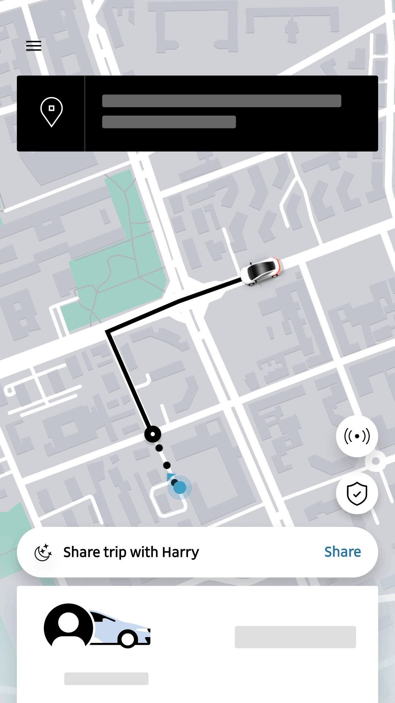
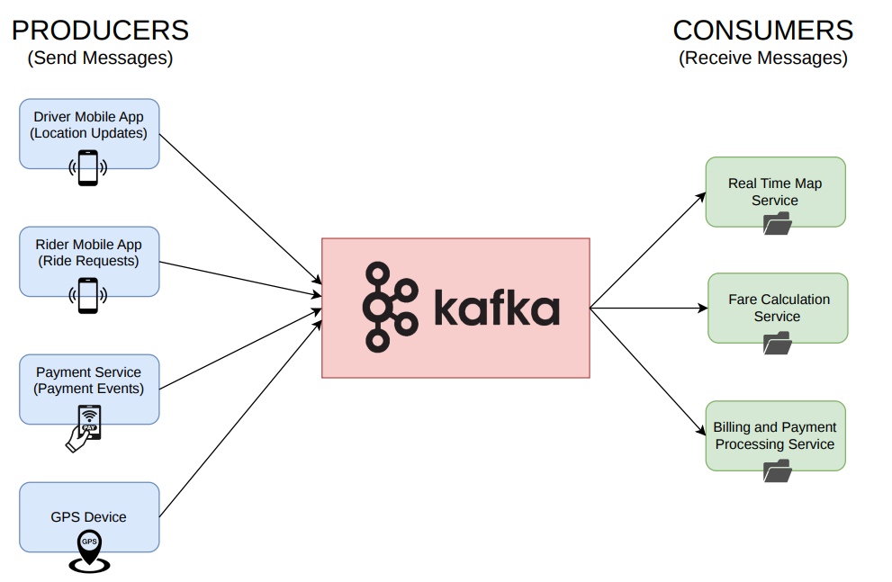
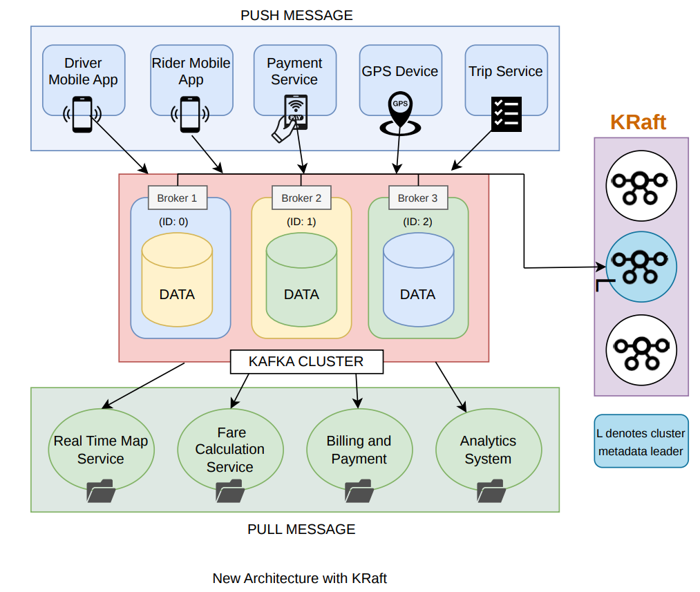

# Apache Kafka: Understanding Real-Time Data Streaming at Scale

## The Real Problem

Open the **Uber** app after booking a ride. You can see the driver moving on the map in real time. Every few seconds, the car's position changes slightly. It feels smooth and simple from the user's side.

But behind that simple map, a large technical system is working continuously.



Every few seconds, the driver's phone sends its current location to Uber's servers. This includes latitude and longitude values. Now think about how many drivers are active at the same time across different cities in the world. Each of them is sending updates again and again. This means Uber's backend is receiving millions of small updates every second.

The system cannot afford to lose these updates. It also cannot slow down. The rider must see the movement instantly. Other services also depend on this data. Trip tracking, billing, analytics, and pricing systems all need the same location data. So one small update from a driver is actually useful to many different parts of the system.

## The Engineering Approach to Handle This Scale

A simple approach would be to write every driver location update directly into a database.

Databases are excellent at **long-term storage**. They can hold billions of records and allow fast searching and querying. In other words, databases solve the **storage problem** very well.

However, they are not built to handle extremely high numbers of small writes every second without limits. If millions of drivers continuously update their location directly into the database, it can become overloaded. Performance drops, latency increases, and the system slows down.

### So the real issue here is not storage. The issue is **throughput**.

This is where **Apache Kafka** fits in.

Kafka is not an alternative to a database, and it is not competing with one. They solve different problems. Kafka is built to handle **massive streams of incoming data at very high speed**. It accepts and distributes events efficiently without becoming a bottleneck.

The database, on the other hand, stores processed and structured data for long-term use and supports complex queries.

They work together to make the system scalable, stable, and efficient.

## How Kafka Solves the Problem

In large systems, applications that generate data are called **producers**, and the systems that read and use that data are called **consumers**.



Producers send events to Kafka, and consumers read the events they need from Kafka.

This creates **decoupling**. Producers do not need to know who is consuming the data. Services can scale, fail, or evolve independently.


Kafka also acts as a **buffer**. If the database or any consumer becomes slow, Kafka temporarily stores the incoming data. Producers can continue sending updates without overwhelming downstream systems.

One important question is: why can Kafka handle such high throughput?

Kafka is optimized for fast, sequential disk writes instead of random writes. It treats data like an append-only log, which is much more efficient for disk operations. It also batches messages together before writing or sending them over the network. Because of this design, Kafka can handle massive streams of real-time data efficiently.

Finally, consumers can read events in batches and perform **bulk inserts** into the database. This is far more efficient than inserting one record at a time and significantly reduces database load.

Now that we understand what Kafka solves, let's see how it actually does it internally.

# Understanding Kafka Architecture

Let us go back to the simple picture we discussed earlier.

Producers send data. Consumers read data. Kafka sits in the middle and manages the flow.

---
## Kafka Clusters, Brokers, and ZooKeeper vs KRaft

## Kafka Clusters and Brokers

But Kafka is not a single machine.

It runs as a **cluster** of servers. Each server in this cluster is called a **broker**. A broker is simply one Kafka server that stores data and handles client requests. Each broker has a unique **broker ID** so it can be identified within the cluster.

A Kafka cluster consists of multiple brokers working together. Each broker stores a portion of the overall data. By distributing data across brokers, Kafka can scale horizontally and handle large traffic loads.

When a producer wants to send a message, it first connects to any broker in the cluster. That broker shares cluster metadata, including which broker is responsible for the required partition. In simple terms, the producer first **gets the broker information**, and then sends the message to the correct broker.

Consumers work differently. They **pull messages** from Kafka. A consumer connects to a broker, fetches messages from its assigned partitions, processes them, and then **updates its offset**. Updating the offset means the consumer records how much data it has already read, so it can continue from the correct position next time.

While brokers handle message storage and client communication, Kafka also needs a mechanism to coordinate the cluster, maintain metadata, and manage leader elections. Over time, Kafka has used two different approaches for this coordination: **ZooKeeper** (historical) and **KRaft** (modern).

---

## ZooKeeper (Historical Architecture)

In early versions of Kafka, **Apache ZooKeeper** was used to coordinate the Kafka cluster.

ZooKeeper acted as a central coordination service that stored cluster metadata and helped manage broker coordination. Kafka brokers communicated with ZooKeeper to keep track of the cluster state.

ZooKeeper handled tasks such as:

- Tracking active brokers in the cluster
- Maintaining broker IDs
- Leader election for partitions
- Storing cluster metadata and configurations

However, ZooKeeper did not store Kafka message data. Producers and consumers interacted only with Kafka brokers, while ZooKeeper worked in the background to coordinate the system.

### ZooKeeper-based Kafka Architecture


---

## Problems with ZooKeeper

Although ZooKeeper worked well initially, it introduced some limitations as Kafka clusters grew.

### 1. Extra System to Manage

Running Kafka required maintaining two distributed systems: Kafka brokers and a ZooKeeper cluster. This increased operational complexity.

### 2. Metadata Stored Outside Kafka

Cluster metadata such as broker registrations and partition leaders was stored in ZooKeeper instead of Kafka, creating additional coordination overhead.

### 3. Scaling Challenges

Large Kafka clusters with thousands of topics and partitions generated heavy metadata traffic, which ZooKeeper was not designed to handle efficiently.

Because of these limitations, Kafka introduced **KRaft**, which manages cluster metadata directly inside Kafka.

---

## KRaft (Modern Kafka Architecture)

Modern Kafka clusters use **KRaft** (Kafka Raft Metadata Mode) for cluster coordination.

KRaft removes the dependency on ZooKeeper and integrates metadata management directly into Kafka using the Raft consensus protocol.

Instead of storing metadata in ZooKeeper, Kafka now maintains a **metadata log** that is replicated across a set of controller nodes known as the **KRaft quorum**.

These controllers manage:

- Cluster metadata
- Broker coordination
- Leader election
- Configuration changes

Because metadata is now managed within Kafka itself, the architecture becomes simpler, more scalable, and easier to operate.

### KRaft-based Kafka Architecture



---

## ZooKeeper vs KRaft

| Feature | ZooKeeper (Older Kafka) | KRaft (Modern Kafka) |
| --- | --- | --- |
| Coordination | External ZooKeeper cluster | Built into Kafka |
| Metadata Storage | Stored in ZooKeeper | Stored in Kafka metadata log |
| Architecture | Kafka + ZooKeeper clusters | Single Kafka cluster |
| Operational Complexity | Higher | Lower |
| Status | Removed in Kafka 4.0 | Current default |

---

## Topics

Inside Kafka, data is organized into **topics**.

You can think of a topic like a **folder** that holds all events related to a specific subject.

Why do we need topics?

Because not all data is the same. In the Uber example, we may have:

For example, in the Uber system:

- `driver-location-updates`
- `ride-status-updates`
- `payment-events`

Each topic contains events of one type. This logical separation helps consumers subscribe only to the data they care about.


---

## Partitions

While a topic is a logical category, the actual storage happens inside **partitions**.

Each topic is divided into one or more partitions. A partition is where events are physically stored.

Why do we need partitions?

If all events of a topic were stored in a single sequence, it would limit scalability. By dividing a topic into multiple partitions, Kafka allows data to be written and read in parallel.

You can think of this like database partitioning. Instead of one large file, we split it into smaller pieces to improve performance.


---

## Ordering and Offsets

Inside a partition, events are stored as an **append-only log file** on disk.

This means:

- New events are always added at the end.
- Existing events are not modified.

Events inside a partition are strictly ordered.

An offset is:

> The sequential ID of each message inside a partition.

Offset 0 → Offset 1 → Offset 2 → Offset 3 …

Offsets help consumers track where they are in the stream.


---

## Segments

A **segment** is just a physical file on disk.

A partition is logically one long ordered log.

But physically, Kafka breaks that log into multiple smaller files called **segments**.

For example:

- One segment may store events from offset 0 to 99
- The next segment may start from offset 100

This makes storage management efficient without affecting ordering.

Each segment is a file like:

```
00000000000000000000.log
00000000000000001000.log
00000000000000002000.log
```

Kafka writes to one active segment.

When it becomes full, Kafka closes it and creates a new one.


---

## Consumers and Consumer Groups

Consumers read messages from topics.

To scale consumption, Kafka uses **consumer groups**.

Within a single consumer group:

- If a topic has two partitions and only one consumer, that consumer reads both partitions.


- If there are two consumers and two partitions, each consumer gets one partition.


- If there are more consumers than partitions, extra consumers remain idle.


- If a consumer fails, Kafka automatically reassigns its partitions to another consumer in the group.


This ensures scalability and fault tolerance.

---

### Why we don't use a message queue

At first glance, Kafka looks similar to a traditional message queue, but there is an important difference.

In most message queues, once a consumer reads a message, that message is removed. Other consumers cannot read it again.

In Kafka, messages are **not deleted after being read**. They remain stored for a configured time, and consumers track their position using offsets.

Because of this, multiple consumer groups can read the same data and apply different logic. Kafka also allows replaying old messages, which is not common in traditional message queues.

In short, message queues focus on task distribution, while Kafka focuses on event streaming and persistence.

# How Does Kafka Guarantee Durability and Fault Tolerance?

We have seen how Kafka stores and distributes data.

Now the real question is:

What happens if something fails?

Servers crash. Networks fail. Consumers restart.

How does Kafka make sure data is not lost?

Let's break it down step by step.

---

## Replication

In Kafka, each partition does not live on just one broker.

Instead, each partition can have **multiple copies**, called **replicas**.

For every partition:

- One replica is selected as the **leader**.
- The other replicas are called **followers**.

Producers send messages only to the leader replica.

Consumers also read from the leader.

Followers continuously copy data from the leader and stay in sync.

If the broker hosting the leader crashes, Kafka automatically promotes one of the followers as the new leader.

Because of replication:

- Data is not lost if one broker fails.
- The system continues running.
- Availability is maintained.


---

## In-Sync Replicas (ISR)

We already discussed replication. Every partition has multiple replicas — one leader and the rest followers.

But here's the important question:

Are all follower replicas always fully up to date?

Not necessarily.

That's where **In-Sync Replicas (ISR)** comes in.

ISR is simply the group of replicas that are fully caught up with the leader. This group always includes the leader itself and any followers that are actively syncing without significant lag.

Kafka continuously monitors followers. If a follower falls too far behind — for example, due to network delay or system slowdown — Kafka temporarily removes it from the ISR.

Let's imagine a partition with three replicas:

- Broker 1 → Leader
- Broker 2 → Follower (almost fully synced)
- Broker 3 → Follower (lagging behind)

In this case, the ISR would contain Broker 1 and Broker 2.

Broker 3 would be excluded until it catches up.


Why is this important?

Because **only replicas inside the ISR are allowed to become the new leader** if the current leader fails.

This protects data consistency. If Kafka allowed an out-of-date replica to become leader, recent messages could be lost.

There is also a connection to producer acknowledgments. When the producer uses `acks=all`, the write is considered successful only after all ISR replicas confirm the write. This ensures that committed data exists on multiple fully synchronized replicas.

In simple terms:

Replication gives you multiple copies.

ISR ensures those copies are safe and up to date.

That is what maintains reliability in Kafka's distributed environment.

---

## Acknowledgment Settings (acks)

When a producer sends a message, it can decide how strict it wants to be.

Kafka provides acknowledgment settings:

- **acks = 0** → The producer does not wait for confirmation. Fast, but risky.
- **acks = 1** → The leader confirms the write. Moderate safety.
- **acks = all** → All ISR replicas confirm the write. Highest durability.

The stronger the acknowledgment level, the safer the data — but slightly higher the latency.

This allows applications to balance performance and reliability.

---

## Delivery Guarantees

Kafka supports different delivery behaviors.

**At most once**

Messages may be lost, but never duplicated.

**At least once**

Messages are never lost, but may be processed more than once.

**Exactly once**

Messages are neither lost nor duplicated.

Achieved using idempotent producers and transactions.

This is extremely powerful for systems like payments or billing.


---

## Retention Policy

Unlike traditional message queues, Kafka does not delete messages immediately after they are consumed.

Messages remain stored based on a **retention policy**.

Retention can be:

- Time-based (for example, keep data for 7 days)
- Size-based (delete old data after a certain storage limit)

Kafka stores data in segment files. When data becomes older than the retention limit, entire segments are deleted.

This design allows:

- Message replay
- Recovery from failures
- New consumers to read historical data
